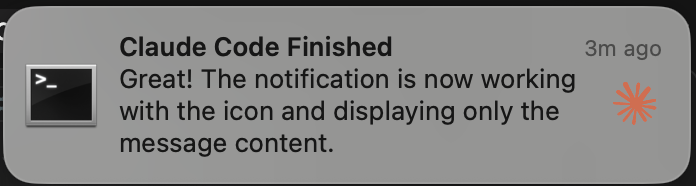

# Claude Code Ping 🔔

Get rich notifications when Claude Code finishes responding. Perfect for
long-running tasks.



Now that Claude Code has
[hooks](https://docs.anthropic.com/en/docs/claude-code/hooks), I decided to make
a notification system that shows Claude's actual response content with a custom icon.

## Quick Start

````bash
# Clone and install
git clone https://github.com/yourusername/claude-ping.git
cd claude-ping
uv sync  # or: pip install -r requirements.txt

# Configure Claude Code settings
# Add to ~/.claude/settings.json:
```json
{
  "hooks": {
    "Stop": [
      {
        "matcher": "",
        "hooks": [
          {
            "type": "command",
            "command": "uv run python /path/to/claude-ping/claude_ping.py"
          }
        ]
      }
    ]
  }
}
````

That's it! You'll now get rich notifications showing Claude's actual response content.

## Features

- 🖼️ Rich notifications with custom icon showing Claude's response content
- 🖥️ macOS native notifications with timestamp
- 📝 Displays actual message text (not just "task complete")
- 🎯 Zero configuration required

## How It Works

The script automatically:
1. Parses Claude Code's transcript file (JSONL format)
2. Extracts the text content from the last assistant message
3. Displays it in a macOS notification with a custom icon

## Requirements

- macOS
- Python 3.8+
- Claude Code CLI
- `terminal-notifier` (install with `brew install terminal-notifier`) for icon support

## Customization

The notification system is designed to work out of the box, but you can customize:

- **Icon**: Replace `icon.png` with your own image
- **Message format**: Edit the notification message format in `claude_ping.py`

## License

MIT
